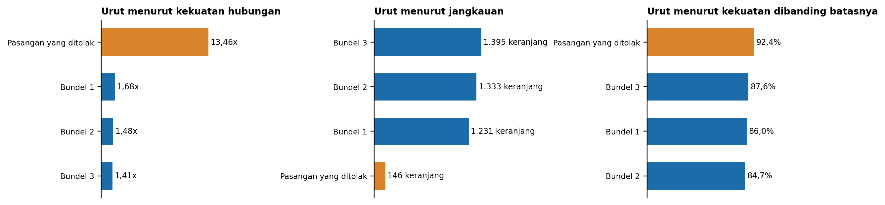
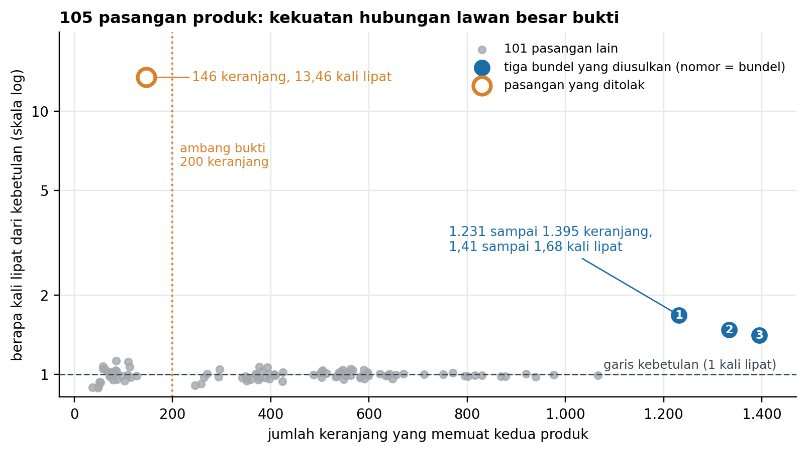

# Pasangan Produk dengan Angka Terbaik Justru yang Paling Tidak Layak Dikampanyekan

**Studi kasus analisis keranjang belanja** untuk memilih bundel kampanye senilai **Rp 80 juta** dari **3.000 keranjang belanja**, dengan SQL di DuckDB dan Python.

[](https://colab.research.google.com/drive/1kkhUb3GK6tIEr0tq4CO93UQpFC8m63qT?usp=sharing)

| Lihat | Tautan |
|---|---|
| **Portofolio (halaman web)** | [https://aoramaaulia-collab.github.io/Market-Basket-Bundle-Analysis/](https://aoramaaulia-collab.github.io/Market-Basket-Bundle-Analysis/) |
| Portofolio versi PDF | [docs/portfolio_basket_2026-09-14.pdf](docs/portfolio_basket_2026-09-14.pdf) |
| Notebook analisis | [Google Colab](https://colab.research.google.com/drive/1kkhUb3GK6tIEr0tq4CO93UQpFC8m63qT?usp=sharing) · [notebook/SQL-02_Market_Basket_DuckDB.ipynb](notebook/SQL-02_Market_Basket_DuckDB.ipynb) |
| Memo keputusan (1 halaman) | [Google Drive](https://drive.google.com/file/d/1euhqoOcZchl4uxEdfF2koQO7H6HPLEqY/view?usp=sharing) · [docs/memo-keputusan_basket_2026-09-14.pdf](docs/memo-keputusan_basket_2026-09-14.pdf) |
| Catatan keputusan | [Google Drive](https://drive.google.com/file/d/1UCXhZ_liE3ZM79gS-ZG41N6mANX8HAh6/view?usp=sharing) · [docs/catatan-keputusan_basket_2026-09-14.md](docs/catatan-keputusan_basket_2026-09-14.md) |
| Lampiran bukti | [docs/lampiran-bukti_basket_2026-09-14.pdf](docs/lampiran-bukti_basket_2026-09-14.pdf) |

---

## Ringkasan

Sebuah e-commerce kecantikan menyiapkan kampanye bundel musiman senilai **Rp 80 juta**, dan tiap bundel memakan porsi anggaran yang sama besar entah laku atau tidak. Analisis **3.000 keranjang belanja** menemukan **tiga pasangan produk yang muncul bersama jauh lebih sering daripada yang bisa dijelaskan oleh larisnya produk itu sendiri**, masing-masing ditopang lebih dari 1.200 keranjang.

Temuan yang lebih menentukan: **pasangan dengan angka paling mencolok justru tidak layak dikampanyekan**, karena hanya menyentuh 146 keranjang. Hasil ini tidak berubah di dua belas cara menghitung ulang.



*Empat pasangan yang sama diurutkan tiga kali. Ikuti batang oranye: posisinya berpindah dari puncak, ke dasar, lalu sejajar dengan bundel lain, padahal datanya sama persis.*

## Temuan utama

- **Tiga pasangan muncul bersama jauh lebih sering daripada yang bisa dijelaskan larisnya produk.** Masing-masing ditopang 1.231 sampai 1.395 dari 3.000 keranjang (41% sampai 46%), dan muncul bersama 1,41 sampai 1,68 kali lipat dari kebetulan.
- **Pasangan dengan angka paling mencolok tidak layak dikampanyekan.** Ia tampak 13,46 kali lipat dari kebetulan, delapan kali bundel terbaik, karena kedua produknya paling jarang sehingga batas maksimumnya jauh lebih tinggi. **Diukur terhadap batasnya masing-masing, keempat pasangan sama kuat** (84,7% sampai 92,4%). Yang membedakan adalah jangkauan: **146 dari 3.000 keranjang**.
- **Hampir separuh pasangan terlihat berhubungan padahal tidak.** 47 dari 105 pasangan di atas garis kebetulan, persis yang diharapkan kalau tidak ada hubungan sama sekali. Hanya 4 yang benar-benar tidak bisa dijelaskan kebetulan.



## Rekomendasi dan alasannya

Kode R, K, dan B adalah nomor rekomendasi, keputusan analisis, dan batas. Nomornya sama di semua berkas, jadi setiap butir bisa ditelusuri ke penjelasan lengkapnya di catatan keputusan.

| No | Rekomendasi | Alasan |
|---|---|---|
| R1 | **Pasang tiga bundel: bundel 1, bundel 2, dan bundel 3.** | Hanya ketiganya yang lolos ketiga syarat dari 105 pasangan, dengan jangkauan 1.231 sampai 1.395 dari 3.000 keranjang, dan hasilnya sama di dua belas cara menghitung ulang. |
| R2 | **Jalankan ketiganya sebagai uji dengan kelompok pembanding, bukan langsung penuh: sebagian pembeli melihat bundel, sebagian tidak.** | Data hanya menunjukkan apa yang sudah dibeli bersama; tanpa pembanding, kenaikan penjualan tidak bisa dibedakan dari pembelian yang memang sudah terjadi. |
| R3 | **Jangan kampanyekan pasangan yang ditolak; pasang di rekomendasi otomatis halaman produk.** | Hubungannya nyata dan sama kuat terhadap batas maksimumnya, tetapi hanya menyentuh 146 dari 3.000 keranjang dengan biaya kampanye yang sama. |
| R4 | **Kalau anggaran hanya cukup untuk dua uji: jalankan bundel 2 dan bundel 3, tunda bundel 1.** | Ruang tumbuh bundel 1 paling kecil (507 keranjang), dan bundel 2 satu-satunya hubungan nyata lintas kategori. |

## Batas

| No | Batas | Kenapa, dan apa yang dilakukan |
|---|---|---|
| B1 | **Penjualan tambahan dari bundel tidak bisa diperkirakan.** | Tidak ada data hasil kampanye; karena itu tidak ada klaim kenaikan penjualan, dan rekomendasi berbentuk uji. |
| B2 | **Semua persentase adalah persentase keranjang, bukan persentase orang.** | Tidak ada ID pelanggan; setiap angka ditulis dengan penyebut keranjang. |
| B3 | **Margin bundel tidak dinilai.** | Harga pokok tidak ada; besaran diskon perlu dihitung tim keuangan sebelum uji. |
| B4 | **Ambang bukti 200 keranjang adalah keputusan analis, bukan sifat data.** | Angka itu tidak berasal dari data; sudah diuji dan hasilnya stabil antara 200 dan 1.200. |
| B5 | **Pembuangan retur tidak membatalkan semua pembelian yang diretur.** | 16 retur penuh tetap terhitung dan 184 retur tidak tertaut; diuji dengan keranjang neto, hasilnya sama. |
| B6 | **375 baris ProductID kosong dibuang, padahal produknya bisa dikenali dari nama.** | Dibuang supaya cocok dengan angka acuan kasus latihan; diuji dengan dipulihkan, hasilnya sama. |
| B7 | **Alasan orang membeli dan produk yang tidak jadi dibeli tidak terlihat.** | Data hanya memuat transaksi yang selesai; alasan pemakaian bundel adalah tafsiran. |
| B8 | **Hasil ini bergantung pada syarat z.** | Tanpa syarat z, 34 pasangan lolos; syarat z dipertahankan di setiap potongan. |

**Yang akan membatalkan rekomendasi ini:** Uji kelompok pembanding yang menunjukkan selisih nol antara pembeli yang melihat bundel dan yang tidak. Satu pertanyaan tidak bisa dijawab dari data ini: kalau orang sudah membeli kedua produk bersama tanpa diskon, bundelnya mungkin hanya membiayai pembelian yang memang sudah terjadi. Uji kelompok pembanding dirancang tepat untuk menjawab itu.

## Cara kerja

1. **Profil data dulu, baru dibersihkan.** 18.815 baris mentah diperiksa kolom demi kolom, lalu 1.556 baris (8,3%) dibuang dalam empat tahap: 835 duplikat persis, 374 tanpa identitas produk, 200 retur, dan 147 sampel gratis.
2. **Keranjang dibentuk sebagai himpunan produk unik per order.** Di self-join, baris ganda mengalikan hitungan pasangan; di data ini duplikat saja menciptakan **4.686 pasangan palsu**.
3. **Tiga ukuran dihitung berdampingan** (support, confidence dua arah, lift), selalu dengan jumlah keranjang di sebelahnya, dan kekuatan hubungan dibaca terhadap batas maksimumnya.
4. **Saringan tiga syarat sekaligus:** lebih sering dari kebetulan, minimal 200 keranjang, dan lolos uji kebetulan (z di atas 1,96).
5. **Diuji dengan dua belas cara menghitung ulang:** data penuh, enam bulan terakhir, lima kuartal terpisah, dan lima cara membersihkan data yang berbeda. Tiga bundel yang sama lolos di semuanya.

## Angka acuan

Siapa pun yang menjalankan ulang analisis ini harus mendapatkan angka yang persis sama. Tidak ada angka acak di dalamnya.

| Pemeriksaan | Angka |
|---|---:|
| Baris mentah | 18.815 |
| Setelah buang duplikat persis | 17.980 |
| Setelah buang ProductID kosong | 17.606 |
| Setelah buang retur (Quantity kurang dari atau sama dengan 0) | 17.406 |
| Setelah buang sampel gratis (Price kurang dari atau sama dengan 0) | 17.259 |
| Keranjang | 3.000 |
| Pasangan yang pernah muncul bersama | 105 |
| Pasangan di atas garis kebetulan | 47 |
| Bundel yang lolos ketiga syarat | 3 |

## Struktur repositori

```
Market-Basket-Bundle-Analysis/
├── index.html                  Portofolio halaman web (diterbitkan ke GitHub Pages)
├── data/
│   └── order_items.csv         Data latihan, 18.815 baris item order
├── notebook/
│   └── SQL-02_Market_Basket_DuckDB.ipynb   Sumber seluruh angka dan grafik
├── sql/
│   └── basket_analysis_Aulia_Aorama.sql    Template SQL-02 yang diisi penuh
├── grafik/                     PNG yang dibuat notebook, dipakai portofolio dan lampiran
├── docs/
│   ├── portfolio_basket_2026-09-14.pdf
│   ├── memo-keputusan_basket_2026-09-14.pdf
│   ├── lampiran-bukti_basket_2026-09-14.pdf
│   ├── catatan-keputusan_basket_2026-09-14.md
│   └── basket_analysis_Aulia_Aorama.pdf
├── requirements.txt
└── .github/workflows/
    ├── deploy-pages.yml        Menerbitkan portofolio setiap kali ada push ke main
    └── periksa-analisis.yml    Menjalankan ulang notebook dan SQL untuk memastikan angkanya tidak berubah
```

## Menjalankan analisis

### Pilihan 1: Google Colab (tanpa memasang apa pun)

Buka [notebook di Colab](https://colab.research.google.com/drive/1kkhUb3GK6tIEr0tq4CO93UQpFC8m63qT?usp=sharing), lalu pilih **Runtime > Run all**. Notebook memasang DuckDB sendiri bila belum ada, dan mengunduh data dari repositori ini bila `order_items.csv` tidak ditemukan.

### Pilihan 2: Komputer sendiri

```bash
git clone https://github.com/aoramaaulia-collab/Market-Basket-Bundle-Analysis.git
cd Market-Basket-Bundle-Analysis
python -m venv .venv
source .venv/bin/activate          # Windows: .venv\Scripts\activate
pip install -r requirements.txt
jupyter notebook notebook/SQL-02_Market_Basket_DuckDB.ipynb
```

Jalankan semua sel. Notebook membaca `data/order_items.csv` dan menyimpan grafik ke folder `grafik/`.

### Pilihan 3: Hanya SQL, dengan DuckDB

```bash
cd data
duckdb
```
```sql
.read ../sql/basket_analysis_Aulia_Aorama.sql
```

Berkas SQL memuat data, membersihkannya, menghitung pasangan, dan menampilkan ketiga bundel, log pembersihan, pemeriksaan aritmetika, serta variasi enam bulan.

## Menerbitkan portofolio ke GitHub Pages

1. **Buat repositori baru** di GitHub dengan nama `Market-Basket-Bundle-Analysis`, bersifat publik.
2. **Unggah seluruh isi folder ini** ke cabang `main`, termasuk folder tersembunyi `.github` dan berkas `.nojekyll`:
   ```bash
   git init
   git add .
   git commit -m "Analisis keranjang belanja: bundel kampanye Ramadan"
   git branch -M main
   git remote add origin https://github.com/aoramaaulia-collab/Market-Basket-Bundle-Analysis.git
   git push -u origin main
   ```
3. Di GitHub buka **Settings > Pages**, lalu pada **Build and deployment > Source** pilih **GitHub Actions**.
4. Buka tab **Actions**. Alur **Terbitkan portofolio ke GitHub Pages** berjalan otomatis; tunggu sampai bertanda centang hijau.
5. Portofolio tampil di **https://aoramaaulia-collab.github.io/Market-Basket-Bundle-Analysis/**

Setiap kali ada perubahan yang di-push ke `main`, portofolio diterbitkan ulang otomatis. Alur **Periksa analisis** ikut menjalankan ulang notebook dan SQL; kalau ada satu angka acuan yang berubah, alur itu gagal dan memberi tahu Anda.

**Kalau memakai nama repositori lain,** ganti nama itu di dua tempat: variabel `REPO_RAW` di sel pertama notebook, dan alamat repositori di README ini.

## Catatan data

Data dalam studi kasus ini adalah **data latihan** yang dibuat menyerupai pola transaksi sebuah e-commerce kecantikan. Ini bukan data perusahaan nyata, dan tidak disajikan sebagai pengalaman kerja di perusahaan mana pun. Portofolio sengaja tidak menampilkan nama produk; berkas kerja di folder `docs/` memakai nama dari kasus latihannya. Angka anggaran Rp 80 juta berasal dari pemangku kepentingan dan hanya dipakai sebagai konteks.

## Kontak

**Aulia Aorama** · [aoramaaulia@gmail.com](mailto:aoramaaulia@gmail.com) · [github.com/aoramaaulia-collab](https://github.com/aoramaaulia-collab)
